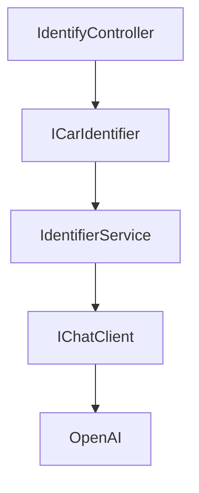
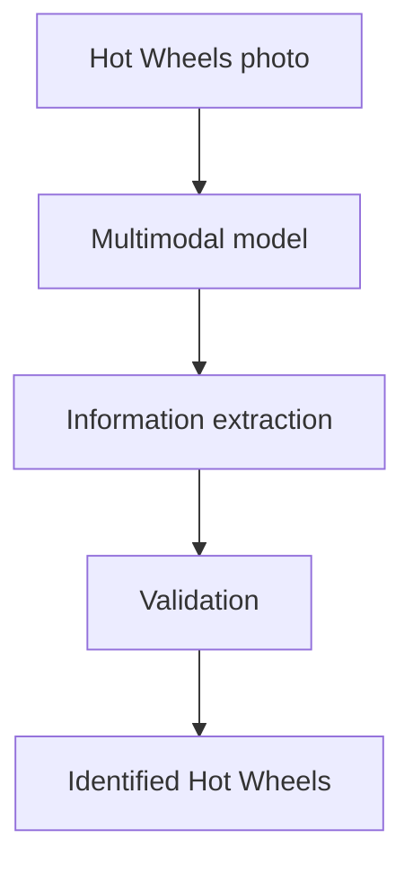

# Objective

The user submits a photo of a Hot Wheels car, preferably still sealed, with the card/blister visible.

The application uses AI to:

1. Identify the model.
2. Extract information visible on the packaging.
3. Validate the identification.
4. Structure a response for the user.

---

## API flow

### Identify

Upload an image of the packaged car:

```http
POST /api/cars/identify
Content-Type: multipart/form-data

Image = car.jpg
```

The response uses the shared `CarResult` envelope. The API stores the image in memory for the price search and returns its job ID:

```json
{
  "carIdentification": {
    "name": "BMW GT4 M3",
    "yearOfRelease": 2026,
    "manufacturer": "BMW",
    "model": "GT4 M3",
    "priceSearchJobId": "00000000-0000-0000-0000-000000000000"
  },
  "priceSearchResult": null,
  "priceSearchStatus": "Pending",
  "priceSearchStartedAt": null,
  "priceSearchCompletedAt": null,
  "priceSearchFailureReason": null
}
```

### Start the price search

Start a background search using the `priceSearchJobId` returned by Identify:

```http
POST /api/cars/price-jobs/{priceSearchJobId}
```

The endpoint responds with `202 Accepted` and the same `CarResult` envelope. Repeated calls do not enqueue the same job more than once.

### Poll the price search

Poll the same resource until `priceSearchStatus` is `Completed` or `Failed`:

```http
GET /api/cars/price-jobs/{priceSearchJobId}
```

While pending or running, `priceSearchResult` is `null`. Completed jobs include the result; failed jobs include a safe failure reason. Unknown or expired IDs return `404 Not Found`.

Jobs are stored in memory: unstarted jobs expire after 30 minutes, and completed or failed jobs expire after 24 hours. A process restart clears all jobs.

All endpoints use the `CarResult` response envelope; fields not yet available for that step are `null`.

---

## Initial Architecture


The API receives the image and communicates with the AI model and the background price-search worker.

The frontend will not have access to the OpenAI API key.

---

## Backend

### Technologies

- .NET / ASP.NET Core
- C#
- REST API
- Microsoft.Extensions.AI
- OpenAI as the initial provider

The goal is to use the recommended abstractions from the .NET ecosystem to avoid unnecessary coupling to the AI provider.

### Conceptual Structure

Organize the backend by vertical slices, with one slice per action:

- Each action has its own controller; a controller must not combine multiple actions.
- Keep the action's related API request/controller, application command/handler, and tests together in matching feature folders where applicable.
- Keep shared contracts and cross-cutting components in their existing shared locations rather than duplicating them in slices.

For example, identifying a car and starting or retrieving a price-search job are separate actions and belong to separate slices, even when their endpoints share a route prefix.



The application uses `ICarIdentifier` and the concrete `IdentifierService`, which is isolated from the OpenAI provider through the `IChatClient` abstraction. Price search uses `IPriceFinder`; jobs are queued through application abstractions and processed by an Infrastructure background worker.

This will make it possible to change the model or provider later.

### Configuration

The OpenAI implementation is configured at the API composition root and exposed to the
identification service through `IChatClient`. It uses `DataContent` to send the uploaded image
with its MIME type. The AI JSON Schema is generated from an internal identification DTO; operational
fields such as `priceSearchJobId` are generated by the application and are not requested from the model.

For local development, set the API key in
`src/CarIdentifier.Api/appsettings.Development.json`. This file is ignored by Git so the key
stays local:

```json
{
  "OpenAI": {
    "ApiKey": "<your-api-key>"
  }
}
```

The application will not start if the API key is missing. `OpenAI__ApiKey` can also be supplied
as an environment variable. The optional `OpenAI:Model` setting defaults to `gpt-4o-mini`.

---

## AI Identification

The AI will receive:

- A photo of the Hot Wheels car
- Instructions to identify the product
- A request not to invent information

Priority will be given to information visible on the packaging:

- Model name
- Year
- Collection number
- Series
- Product code
- Real-world manufacturer
- Real-world vehicle model
- Other visible information

### Flow



### Response contract

The service sends the uploaded image as a multimodal message and asks the model to return a JSON object containing identification fields. The API maps that response to `CarIdentification` and adds the job ID:

```json
{
  "name": "BMW GT4 M3",
  "yearOfRelease": 2026,
  "manufacturer": "BMW",
  "model": "GT4 M3",
  "priceSearchJobId": "00000000-0000-0000-0000-000000000000"
}
```

Rules enforced by the service:

- `name`, `manufacturer`, and `model` are nullable strings.
- `yearOfRelease` is a nullable integer.
- The model must not invent data; if a field cannot be read with confidence, it should be `null`.
- The service deserializes the response with `System.Text.Json` and throws if the AI provider returns an empty response.

The identification may later be validated through web searches to reduce OCR or interpretation errors.

---
